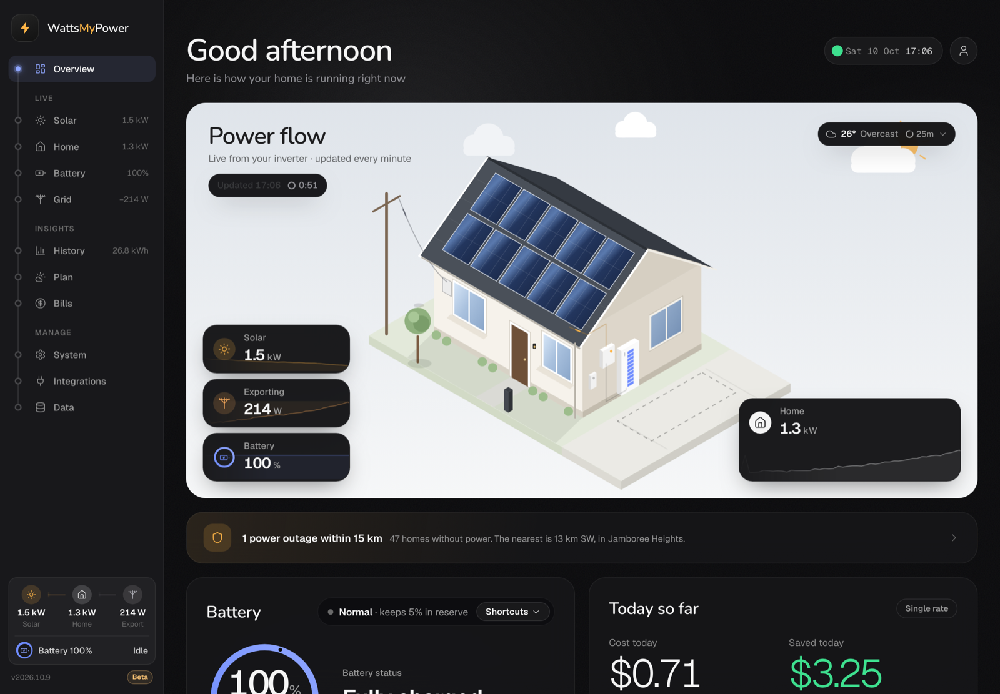
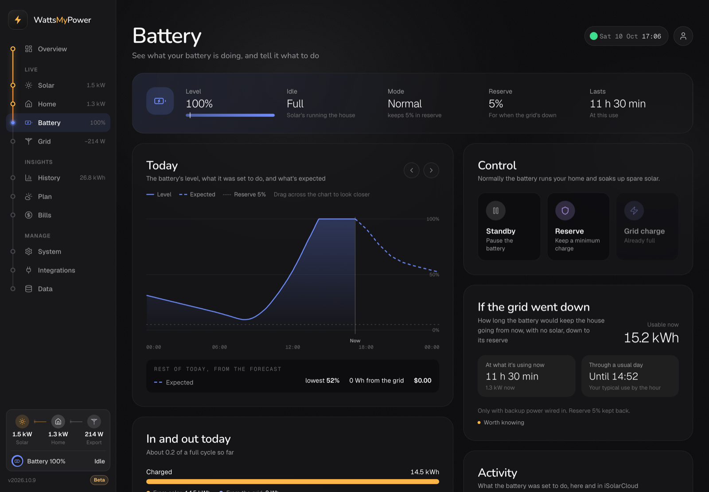
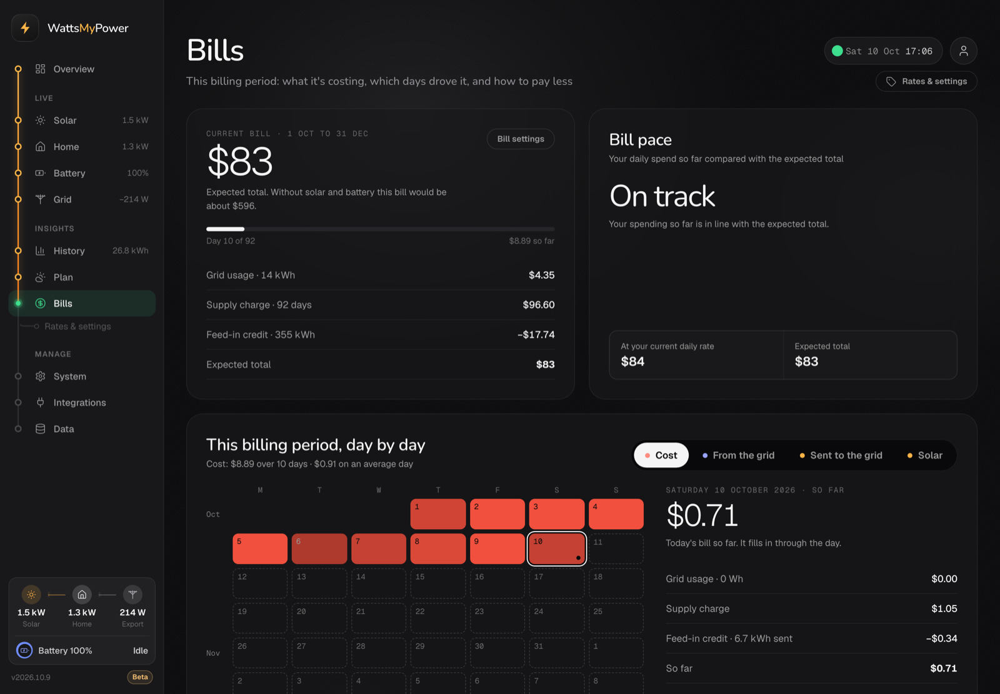

# WattsMyPower

A self-hosted dashboard for a **Sungrow hybrid inverter and battery** (the SH series: SH-RS, SH-RT, SH-T and older). It talks to the inverter directly on your home network (Modbus TCP through its WiNet-S dongle), records a reading every minute in a small SQLite database, and serves a live web dashboard: what your solar, battery, home and grid are doing right now, what today has cost and saved, history, a solar and battery forecast, the system's health, and bills. Nothing goes through Sungrow's cloud, so readings are live rather than delayed.

## Beta

WattsMyPower is in **beta**. It runs a real home's system every day, but it's new to everyone else's: expect rough edges, keep the backups it makes, and tell us what goes wrong. An install follows the beta channel, so it gets each beta as it's released (see [Switching channel](#switching-channel)).

**Australia only.** It's built around Australian services: AEMO's wholesale prices and notices, the electricity networks' outage maps (every state and the ACT), the Bureau of Meteorology's warnings, NEM12 smart meter files and Amber Electric. Money is in AUD and everything is written in Australian English. Outside Australia the live readings, history and forecast may still work, but nobody has tried.

**Tested on:**

- a **Sungrow SH5.0RS** hybrid with a battery, through a **WiNet-S2** dongle (Modbus TCP)
- a **Sungrow SG5K-D** string inverter as a second, AC-coupled system, through its older Wi-Fi dongle (Sungrow's encrypted Modbus)
- Docker in a Proxmox LXC container

The other SH hybrids in [Supported inverters](#supported-inverters) share the SH5.0RS's registers, so they should read the same way, but haven't been tried. If yours works (or doesn't), please [say so](https://github.com/KlemmyDev/WattsMyPower/issues/new/choose).

**What to expect:**

| | |
|---|---|
| **Expected to work** | Readings from the hybrid, battery and grid meter, and a second SG-D inverter; Overview, Solar, Home, Battery and Grid pages; History and CSV downloads; costs, Bills and rates; NEM12 imports; the forecast and Plan; AEMO prices and notices, outages and weather warnings; updates and backups. TP-Link Tapo plugs, Hisense (ConnectLife) washers and dryers, and a Tesla over Bluetooth are used at home every day. **Battery controls** (standby, a floor, charging from the grid) on the SH-RS hybrids they were written for, used at home on an SH5.0RS. |
| **Experimental** | **Battery controls on other hybrids** (SH-RT, SH-T and the rest): they're off until you turn them on for that inverter on the Battery page, as they change what the inverter does and haven't been tried there. Tesla through Tessie. BYD cars (cloud, read only, untested). Bluetti (Bluetooth) and EcoFlow (cloud) portable batteries. Electrolux, AEG and +home appliances (cloud). Shelly plugs and meters. Home Assistant. Amber Electric prices. Importing history from iSolarCloud. These work as far as we know, on little or no hardware beyond our own. |

**Known limitations:**

- Sungrow inverters (one SH hybrid, plus an optional SG-D string inverter) are the ones used every day. GoodWe's ET hybrids and DT string inverters, and Fronius (GEN24, or a Symo or Primo with a Smart Meter), are read from what their makers document but are untested. Other brands need a driver (see [Supported inverters](#supported-inverters)).
- It's served over plain HTTP with one household account. Keep it on your home network; don't port-forward it.
- Only one app should talk to the inverter over Modbus at a time (not Home Assistant or SunGather as well).
- The WiNet-S2 sometimes repeats the same readings for a few minutes; those are left out, so charts show a short gap.
- Outages cover every state and the ACT, not the Northern Territory; bushfire warnings cover Queensland only so far. Plan comparison leaves out controlled load and demand charges.
- Hisense ConnectLife, Electrolux, EcoFlow, Tessie, BYD and Amber go through those companies' clouds, and ConnectLife and BYD have no public API, so they can stop working if Hisense or BYD changes theirs.
- Bluetooth (Tesla, Bluetti) needs an adapter with BlueZ on the server; in a Proxmox LXC the host needs [setting up once](#bluetooth). Windows 10 isn't supported.

**Found a bug?** [Open an issue](https://github.com/KlemmyDev/WattsMyPower/issues/new/choose): the form asks for the version and commit from **Manage → System → Updates**, how it's installed, your inverter, and the last of the logs (`docker compose logs --tail=200`). Security problems go privately instead: see [SECURITY.md](SECURITY.md). [CHANGELOG.md](CHANGELOG.md) lists what's changed.

**Backups.** Every update backs up both databases to `data/backups/` first. For a copy that survives losing the machine, copy `data/` and `.env` somewhere else now and then. [Backups and restoring](#backups-and-restoring) has the details.

### Switching channel

Choose the channel in **Manage → System → Updates**, or from the `wattsmypower` folder:

```bash
bash install.sh --channel beta      # or nightly (every change as it's merged), or stable
```

Moving to a channel that's behind the one you're on (Nightly to Beta, say) goes back to its older version, after backing up both databases. [Everyday use](#everyday-use) explains the channels.

### Screenshots







## What it does

- **Live power flow:** solar, battery, home and grid, updated every minute, drawn as an animated house that follows the weather. Make it look like yours in **Manage → System → Your house**: an estate home, a modern one, a Queenslander, a Federation brick home or a farmhouse, one or two storeys, no garage or a single or double one, and each inverter and battery on an outside wall or in the garage (as many as are connected are drawn).
- **Today's cost and savings,** priced at your actual rates (single rate or time of use), split by rate.
- **History:** a calendar-year heatmap; pick any day to see it in 5-minute steps, with that day's weather; CSV downloads.
- **Plan:** today and the next two days of solar, home use, battery level, grid power and cost, from the local weather (Open-Meteo), calibrated to your own system. Pick a day to see it hour by hour (today shows what's been recorded so far, then the forecast), with the likely range for its solar and the best times to use power: when spare solar would otherwise go to the grid, the costliest hours to go easy on the grid, and on Amber, when prices drop below zero. It warns ahead of time when the battery will run down to its reserve, won't fill, or a day looks dull, and shows how close the day-ahead forecast has been lately. Every hour's weather is kept (and filled in for older days with readings), and the forecast learns from it how your roof turns sunshine into solar: its direction, shade through the year, heat and the inverter's limit. It switches to what it has learned only once that tests as more accurate. Units, the weather model and the panels' angle are in **Manage → Integrations → Weather**.
- **Battery** (in the navigation when there's a battery): its level now and over the last six hours, and **controls** that change what the inverter does with it: **standby** (it neither charges nor discharges, so the house runs on solar and the grid and the battery keeps its charge), a **floor** it won't discharge below (the grid takes over there, handy before a storm), or a **charge from the grid** at a set power to a set level. Each runs for an hour, three, until a time or until it's stopped, then the battery goes back to normal, even across a restart. While iSolarCloud (a command from its app) or anything else has the battery, the controls only say what it's doing and change nothing. They're on for Sungrow's SH-RS hybrids (like the SH5.0RS), the models they've been tried on; on any other model they stay off unless you turn them on for that inverter as an experiment. A charge from the grid asks first. Then where today's charge came from (solar or the grid) and where the discharge went (the house or the grid), with the time to full or to the reserve; how long it would keep the house going if the grid went down now (at today's use, and through a usual day's); what it reports (rate against its maximum, voltage, current, and its temperature through the day against the 15–35°C it likes); and what went in and came out each day over the last 30. Then how the battery is holding up: its health, cycles and efficiency month by month, how much of its warranty is used, and whether it's the right size, with what 5 or 10 kWh more storage would have saved over the last 90 days at your rates.
- **Solar:** what the panels are making now (and how much of the array that is), today so far against what the forecast expected hour by hour, where it should end up by midnight (with the range it usually lands in), where today's solar went (the house, the battery, the grid), each inverter and each string of panels (MPPT voltage, current and power), the days ahead, the last 30 days against the day-ahead forecast, and how the panels are holding up: each day against what the weather allowed (with likely causes: dust, new shade, the inverter's limit) and month by month over the year.
- **Grid:** whether the grid is holding up, and what to do if it isn't: AEMO's warnings for your region (Lack of Reserve, load shedding, power system events), thunderstorms in the forecast, and the inverter losing the grid. When there's a battery, it says how long it would last and links to charging it from the grid while the grid's still there. Then what the house is drawing from and sending to the grid now and through the day, the region's **wholesale price** from AEMO every five minutes with AEMO's forecast to the early hours, the grid's voltage and frequency at your house (high voltage makes the inverter hold back exports), and AEMO's notices for the region. The region is worked out from your location; pick another, or stop following AEMO, on the page. AEMO's data is public: no account or key. **Outages near you:** outages now and planned work within a radius you choose (15 km to start), on a radar around the house and listed with their suburbs, streets, homes affected and times, from your electricity network's public outage map: Energex and Ergon Energy (Queensland); Ausgrid, Endeavour Energy and Essential Energy (New South Wales); Evoenergy (the ACT); CitiPower, Powercor, Jemena, United Energy and AusNet Services (Victoria); SA Power Networks; TasNetworks; Western Power and Horizon Power (Western Australia). Not the Northern Territory yet. These are the feeds behind each network's own map, not official APIs, so any of them may change or stop working. The network is worked out from your location (its service area, Victoria's suburb list, or roughly where each network is; where it can't be told, every network that might serve you is followed), or chosen in **Manage → Integrations → Grid**. Add your street (its name only, never the number) there and the ones that reach it are marked. The whole network's outages are downloaded and matched on your server, so your location and street are never sent anywhere. The Overview shows a compact card whenever there's something to know. **Weather and fire warnings:** the Bureau of Meteorology's severe thunderstorm, severe weather, cyclone, flood and fire weather warnings for your district (from its public FTP service, matched to your nearest forecast town and the rivers gauged near you), and in Queensland the Fire Department's bushfire warnings within your radius (and fires without a warning close by). Turned off in **Manage → Integrations → Grid**.
- **Bills:** the current billing period first (set in **Bills → Rates & settings**). The bill so far and its expected total, after any discount and credits, against your budget if you set one, and whether spending is on pace. Every day of the period as a calendar, coloured by its cost (credits in green), grid use, peak-rate use on time of use, solar sent to the grid, or solar; select a day to see its grid use by rate, supply charge and feed-in against the period's average day, with the costliest, cheapest and biggest feed-in days a click away, and the days still to come outlined with what they're expected to cost. **Ways to lower this bill** ranks changes worked out from the last 30 days at your rates, each with roughly what it's worth over a bill: moving some peak-rate use into the middle of the day or a cheaper rate, using more of the solar you export, trimming what's always on overnight (priced at the night rate for what came from the grid and the feed-in rate for what the battery covered), and, when the supply charge is most of the bill, comparing plans. **When grid power costs you** shows what grid power cost by hour of an average day, month by month, with the dearest rate's hours outlined. Then where the money went (usage, supply and feed-in; by rate; cost per kWh used), the next few bills and the year ahead, past bills, and the **return on your system**: what solar and the battery have saved, a year and in all, and when the system pays for itself (with its cost and install date in **Manage → System**).
- **Imported history:** bring in the days before it was set up (or fill gaps) from iSolarCloud's 5-minute power-curve exports, under **Manage → Integrations → Inverters → Sungrow → Import history from iSolarCloud**, which also explains what to export.
- **Home:** where your home's power goes. First the whole house, from the inverter (no plugs needed): what it's using now and where that's coming from (solar, the battery, the grid), today so far against a usual day by now, where it should end up by midnight, today's peak, and what today's grid power cost (and what solar and the battery saved); today's use through the day against a usual day; where today's came from, with how self-powered the house was today and over the last 30 days; and the last 30 days stacked by source, with the usual weekday and weekend day. Everything the home used (from the inverter, as Bills counts it), today by the hour or the last 7 or 30 days by the day, split between the appliances and plugs you've connected and everything else, with each one's share. Then each device: whether it's running now (and how long it has left), what it used, how many runs and what one takes, the days and times it usually runs ("Usually Wednesdays and weekends, mornings"), and its last run. Connect them in **Manage → Integrations → Smart home**. **TP-Link Tapo** plugs that measure energy (P110, P115 and others) are read straight from each plug on your network every 15 seconds, with no cloud: they're found by themselves (or give their addresses), on either way the plugs' firmware speaks: KLAP, or TPAP on the newest (P110 1.4.8 and later). Your TP-Link ID and password are kept on the dashboard's server and only ever sent to your plugs (TPAP needs the password each time it signs in), and newer firmware needs **Tapo Lab → Third-Party Compatibility** turned on in the Tapo app. **Hisense** washers and dryers (and Gorenje and ASKO) are read from the ConnectLife app's cloud, with the account's email and password, as there's no way to read them on the network. ConnectLife has no public API, so it's read the way its app reads it and can stop working if Hisense changes it; laundry reports each cycle's energy once it finishes, not its power as it runs. **Electrolux, AEG, Frigidaire and +home (Westinghouse) appliances** are read through Electrolux Group's official developer API. It's cloud-only because there's no local way: these appliances only talk to Electrolux's cloud. (A "Westinghouse fridge with an app" in Australia is almost always an Electrolux-branded one in the Electrolux app, as no Westinghouse-branded fridge sold here has Wi-Fi; Westinghouse's own connected products are air conditioners in the +home app. Both are on an Electrolux Group account.) Fridges and freezers show their temperatures (what each compartment's at, and set to), whether a door's open, fast-freeze and holiday modes, and their alerts; washers, dryers, dishwashers and ovens when they run, their program and how long they've left; air conditioners whether they're on, their mode and the room's temperature. None of them report their power, so no energy is recorded for them. To connect: 1. sign in at [developer.electrolux.one](https://developer.electrolux.one) with the account your appliances are in (the one you use in the Electrolux, AEG or +home app); 2. open **Dashboard** and create an **API key**; 3. on the same page press **GET ACCESS TOKEN** and copy the **refresh token** (and, if you like, the access token beside it); 4. paste them into **Manage → Integrations → Smart home → Electrolux**. The tokens are swapped for new ones about every 12 hours and kept on your server; if it ever says to sign in again, get a fresh pair the same way. It only reads the appliances, never changes them, and stays inside the free tier's 5,000 requests a day: the list of appliances once an hour, and each appliance every 5 minutes (so up to about 15 on one account). Each device can be renamed, set as another kind (a smart plug as the washer it powers, so its runs are recorded) or left out of the breakdown, and what it last sent can be checked and copied. More integrations (smart plugs, other appliances) slot in the same way: see `app/features/home`.
- **A second, older Sungrow inverter** (for example an SG5K-D on an AC-coupled system) can be added, so both systems count.
- **Your data, in the open:** **Manage → Data** shows everything stored, in both databases (the dashboard's and the collector's): each table's size on disk and its indexes, rows, the dates it covers, how long it's kept, how fast it's growing and where it levels off, what's in it (inverter by inverter, recorded or imported, forecast or past weather), and its columns. Saved settings show their names only, never what's in them.
- Works on desktop and phones.

## What you need

- A Sungrow SH hybrid inverter (SH-RS, SH-RT, SH-T, the older SH-K, or MG-RL; see [Supported inverters](#supported-inverters)) with a **WiNet-S or WiNet-S2** dongle on your home network (or, on models that have one, its own network port). Any battery it runs (Sungrow SBR or SBH, or another make it supports) is read through the inverter, so the battery's model doesn't matter. The dashboard finds it by scanning your network; if it can't, you'll need its **IP address** (from your router's list of connected devices, or the iSolarCloud app).
- A **computer on the same network that stays on**, to run it in Docker:
  - **Linux** (the best fit): a Proxmox LXC container or VM, a Raspberry Pi, or any Debian or Ubuntu box. The install script sets up Docker on it if needed.
  - **A Mac**, with Docker Desktop.
  - **Windows 11**, in WSL (Windows' built-in Linux), set up for you by the Windows installer.
- Optional: a second, older Sungrow inverter with a Wi-Fi dongle (found by the same scan).

## How it fits together

Two services, run together by Docker Compose:

- **The collector** (`wattsmypower-collector`) is the only thing that talks to the inverters. Every poll it stores the raw register values it read, uninterpreted, in `data/collector.db`, and serves them over a token-protected feed ([collector/PROTOCOL.md](collector/PROTOCOL.md)). It rarely changes, so updates to the dashboard leave it recording without a break.
- **The dashboard** (`wattsmypower`) follows that feed and does everything else: decoding the registers, merging a second inverter, readings and rollups (`data/wattsmypower.db`), costs, forecast, insights, savings, sign-in, and the web app. If the way a register is read ever turns out to be wrong, `python -m app reprocess` rebuilds the readings from the collector's raw history.

Both run as an ordinary user, not root: whoever owns the `data` folder on the machine, or uid 10001 when that's root ([docker-entrypoint.sh](docker-entrypoint.sh) hands them the folder at each start, so an install from before just carries on). Their logs are kept to 30 MB each.

## Install

Follow the steps for your computer, then [open the dashboard](#open-the-dashboard). On Linux and a Mac you run the install script; on Windows a PowerShell script sets up WSL and runs it there for you.

### Linux

1. **Log in to the Linux machine** (for example `ssh root@<machine IP>`, or the Proxmox console). If it's an unprivileged Proxmox LXC container, first turn on `nesting=1` in the container's **Options → Features**, so Docker can run in it.

2. **Run the installer:**

   ```bash
   curl -fsSL https://raw.githubusercontent.com/KlemmyDev/WattsMyPower/main/install.sh | bash
   ```

   (On a minimal system without curl, run `apt install -y curl` first. Prefix commands with `sudo` if you're not logged in as root.)

   It installs Docker if it's missing (asking first), and sets Docker to start at boot so the dashboard comes back by itself after a restart. Then see [what the installer does](#what-the-installer-does).

### Mac

1. **Install [Docker Desktop for Mac](https://docs.docker.com/desktop/setup/install/mac-install/)** and open it once. In its **Settings → General**, keep **Start Docker Desktop when you sign in to your computer** turned on: WattsMyPower only records while Docker Desktop is running.

2. **Open Terminal** and run the installer from your home folder:

   ```bash
   cd ~
   ```

   ```bash
   curl -fsSL https://raw.githubusercontent.com/KlemmyDev/WattsMyPower/main/install.sh | bash
   ```

   If git isn't installed yet, macOS offers to install its command line tools: accept, then run the installer again. Docker Desktop is started if it isn't running. Keep the folder inside your home folder: Docker Desktop only shares that with Docker unless you add others in **Settings → Resources → File sharing**. Then see [what the installer does](#what-the-installer-does).

3. **Keep the Mac awake.** In **System Settings → Energy** (on a laptop, **Battery → Options**), turn on preventing automatic sleeping when the display is off. After a restart, Docker Desktop starts once you sign in, and WattsMyPower with it.

### Windows

Windows 11 (22H2 or later). WattsMyPower runs in its own WSL (Windows Subsystem for Linux) distribution, called `WattsMyPower`, with Docker inside it. It starts with Windows, even before anyone signs in, and doesn't need Docker Desktop.

1. **Open PowerShell** (Start → type *PowerShell*) and run:

   ```powershell
   irm https://raw.githubusercontent.com/KlemmyDev/WattsMyPower/main/install.ps1 | iex
   ```

   It asks for administrator permission. If WSL isn't installed yet, it installs it, turns on the Virtual Machine Platform feature and Windows' hypervisor, and restarts the PC once, after a minute's warning; after you sign in again it carries on by itself. If virtualization is turned off in the PC's firmware (BIOS/UEFI), which Windows can't change, it offers to restart straight into the firmware settings so you can turn it on (often called Intel Virtualization Technology or VT-x, AMD-V or SVM Mode).

2. **It sets everything up,** with no questions:
   - creates the `WattsMyPower` distribution (Ubuntu 24.04) with systemd, so Docker runs as a service in it
   - turns on WSL's mirrored networking (`networkingMode=mirrored` in `.wslconfig`), so the dashboard is at this PC's own address. This applies to any other WSL distributions you have too.
   - runs [install.sh](install.sh) in it, which installs Docker and WattsMyPower, takes the time zone from Windows, and uses port 8080
   - lets the dashboard's port through the firewall
   - adds a scheduled task, `WattsMyPower`, that starts it with Windows and keeps it running
   - offers to stop the PC sleeping while it's plugged in, since it only records while the PC is awake

   It finishes by printing the dashboard's address, for example `http://192.168.1.50:8080`.

It follows the beta [release channel](#everyday-use). To choose another, pass `-Channel` (`nightly`, `beta` or `stable`):

```powershell
& ([scriptblock]::Create((irm https://raw.githubusercontent.com/KlemmyDev/WattsMyPower/main/install.ps1))) -Channel stable
```

To update, run the same command again. For everything in [Everyday use](#everyday-use), open the distribution with `wsl -d WattsMyPower`, then `cd ~/wattsmypower`. Its files are at `\\wsl$\WattsMyPower\root\wattsmypower` in File Explorer, for example to copy a backup.

If Windows is itself a virtual machine, turn on nested virtualization for it first. Windows 10 isn't supported: it doesn't have mirrored networking, which lets other devices reach the dashboard.

To remove it, in PowerShell as administrator (this deletes its data, so copy `data/` out first if you want to keep it):

```powershell
Unregister-ScheduledTask WattsMyPower -Confirm:$false; Remove-NetFirewallHyperVRule -Name WattsMyPower; wsl --unregister WattsMyPower
```

### What the installer does

It downloads WattsMyPower into a `wattsmypower` folder where you run it (installing git first if it's missing, asking first). To use another folder, put `WMP_DIR=/opt/wattsmypower` before `bash`. If you'd rather read the script before running it, download it, look it over, then run it:

```bash
curl -fsSLO https://raw.githubusercontent.com/KlemmyDev/WattsMyPower/main/install.sh
bash install.sh
```

It asks for your time zone and the port for the dashboard (8080 unless you change it), saves your answers to `.env`, builds and starts the app, waits until it's responding, and prints its address, for example `http://192.168.1.50:8080`.

It installs the beta [release channel](#everyday-use)'s version. To choose another (`nightly`, `beta` or `stable`), pass `--channel` after `bash -s --`:

```bash
curl -fsSL https://raw.githubusercontent.com/KlemmyDev/WattsMyPower/main/install.sh | bash -s -- --channel stable
```

### Open the dashboard

**Open that address** in a browser on any device on your network. (On the computer it runs on, use that address too rather than `localhost`: the inverter scan starts from the network the dashboard was opened on.) The first visit asks you to create the dashboard's account (a username and password), with the one-time set-up code: `install.sh` shows it when it finishes, and it's also in `docker compose logs wattsmypower` and `data/setup-code`. After that, every browser signs in with it. A short set-up guide then walks you through the rest, and any step can be skipped:

- **Connect your inverter:** scan your network and connect your hybrid (and a second inverter if you have one). Readings start within a minute.
- **Your system:** the solar array's size (the forecast starts from it, and it's 6.6 kW until it's entered), and the battery details your inverter can't report.
- **Your electricity plan:** enter the rates from your bill (or connect Amber Electric), beside a chart of them through the day.
- **Where you live:** your suburb, for the weather forecast.
- **Your billing period:** how often you're billed and when a period starts.

Everything in it is also in the dashboard (Manage → Integrations and System, and Bills → Rates & settings), and **Manage → System → Open the set-up guide** brings it back. Updating an install that's already set up (an inverter connected, readings recorded, or rates, location or billing period saved) never shows it.

## Everyday use

Run these from the `wattsmypower` folder (in Terminal on a Mac; on Windows, in `wsl -d WattsMyPower`, then `cd ~/wattsmypower`):

| Command | What it does |
|---|---|
| `bash install.sh` | update to the latest version on your release channel (backs up both databases first) |
| `bash install.sh --channel stable` | follow another release channel (`nightly`, `beta` or `stable`) from now on, and install its version, newer or older |
| `bash install.sh --configure` | change your settings (time zone, port) and restart. Inverters are changed in **Manage → Integrations**, and the array size and battery in **Manage → System**. |
| `bash start.sh` | start it, and Docker (or Docker Desktop on a Mac) if needed, without updating or rebuilding |
| `docker compose stop` | stop it |
| `docker compose logs -f --tail=50` | watch the logs (add `collector` or `wattsmypower` for one service) |
| `docker compose exec wattsmypower python -m app reprocess [YYYY-MM-DD]` | rebuild readings from the collector's raw registers (from a date, or everything it holds), after a fix to how they're decoded |
| `bash install.sh --no-dashboard-updates` | update, and stop updating from the dashboard (removes the cron job below) |
| `bash install.sh --rollback` | go back to the version before the last update, with the databases as they were before it (see below) |
| `bash install.sh --uninstall` | stop it and remove its containers, images and cron job, leaving your data and settings in the folder (see below) |
| `bash install.sh --yes` | install or update without questions; settings can be passed in, e.g. `TZ=Australia/Perth bash install.sh --yes`. On a first install, `PV_KW=10` sets the array size and `INVERTER_HOST=192.168.1.20` connects the inverter, without the dashboard. |

**Release channels.** An install follows one of three, chosen in **Manage → System → Updates** or with `--channel`:

| Channel | What it gets |
|---|---|
| Nightly | every change as soon as it's merged to `main` |
| Beta (the default) | pre-releases (tags like `v2026.10.10-beta`, then `-beta.2`) and every stable release, whichever is newer |
| Stable | stable releases only (tags like `v2026.10.10`) |

A new install follows Beta. An install from before Beta was the default, with no channel chosen, carries on following Nightly (`install.sh` saves that on its next update); `--channel beta` moves it. Until something is released on a channel, an install on it stays on the version it has.

An update installs the channel's version, so moving to a channel behind the one you're on (Nightly to Stable) goes back to its older version: the dashboard offers **Go back** rather than **Update now**, and `install.sh` lists the changes it leaves out. The databases are backed up first, as on any update; tables and columns a newer version added are left as they are and used again when it's updated. The channel is kept in `data/update/channel`, where the dashboard and `install.sh` both read it.

**Updating** pulls the latest version on the channel, backs up both databases to `data/backups/` without stopping the app, rebuilds, waits until the app responds, and removes the image from the update before last. If the dashboard isn't running (or keeps restarting), the backup is made with its image, or with `sqlite3`, or by stopping it and copying the files; if none of those works, the update stops before rebuilding (`--no-backup` carries on without one). Backups are named for the version they were taken from (`wattsmypower-20261010-091500-2026.10.9-beta.db`): the newest 5 of each database are kept, plus the newest from each of the last 5 versions and from each channel, so the last one from before you tried beta stays. They're on the same disk as the app, so copy one somewhere else now and then. Your data (`data/`) and settings (`.env`) are never overwritten. If a setting the app is using isn't in `.env` yet (because it came from an older version's default), it's written into `.env` with the value in use, so updates never change your setup. If you've edited any of the app's files, it stops rather than overwrite them.

**Updating from the dashboard.** The dashboard checks GitHub every few hours for a newer version on its channel (**Manage → System → Updates**, where the check can be turned off) and says so at the foot of the navigation. `install.sh` also adds a cron job that runs `updater.sh` every minute, so **Update now** there can do the update: the dashboard leaves a request in `data/update/`, and `updater.sh` runs `bash install.sh --yes` on this machine, as you would, writing its progress to `data/update/update.log`. The dashboard only asks: it can't run anything itself, and the container gets no access to Docker. It needs Docker usable without a password (your user in the `docker` group, or Docker Desktop) and no local changes to the app's files; otherwise Manage → System → Updates says why and shows the command to run instead.

**Moving an existing install to a git checkout** (for example one copied over as a zip): run the install command above from another folder. It finds the running copy, offers to move its `data/` and `.env` across, and stops it. The old folder is left as it was, so it doubles as a backup.

**Going back.** Each update that changes the version keeps the one it replaced (its images, tagged `:previous`, and in `data/update/previous` its commit and the backup made before it). `bash install.sh --rollback` goes back to it and puts that backup back, after backing up the databases as they are; updating again brings the newer version back.

**Your data** lives in two databases in `data/`: the dashboard's (`wattsmypower.db`: readings, rollups, settings, rates and the account) and the collector's (`collector.db`: the inverters connected and their raw registers). With the default settings the dashboard's grows to about 20 MB over the first 90 days, then by about 18 MB a year. The collector's keeps a year of the inverters' raw registers (`COLLECTOR_RETENTION_DAYS`, so readings can be rebuilt from them): with a second inverter that's about 550 MB once it's full, a little less with one, and it stays about that size after. `install.sh` keeps `data/` and `.env` readable by you alone.

### Backups and restoring

Every update backs up both databases to `data/backups/` first, named by when they were made and the version (and channel) that made them: `wattsmypower-20261010-093000-2026.10.9-beta.db` and `collector-20261010-093000-2026.10.9-beta.db`. If the dashboard can't make them (it isn't running, or keeps restarting), `install.sh` makes them on this machine instead, and if it can't make them at all it stops before updating (`--no-backup` goes ahead anyway). The newest 5 of each are kept, plus the newest from each of the last 5 versions and from each channel, so the last backup from before you tried a beta stays. They live on the same machine, so for a copy that survives losing it, copy `data/` and `.env` somewhere else now and then (stop it first with `docker compose stop` for a consistent copy, then `docker compose start`).

**Downloading a backup:** **Manage → Data → Download a backup** saves a zip of the dashboard's database, or of both databases with **Everything**, copied safely while the app keeps running. It holds the passwords and tokens you've saved for connected services, so keep it private. To restore it, follow the `README.txt` inside: stop the app, copy the files into `data/`, delete any `-wal` or `-shm` files there, and start it again.

`bash install.sh --rollback` puts back the backup from before the last update (see **Going back**). To restore another by hand, from the `wattsmypower` folder, using the pair of backups from the same time:

```bash
docker compose stop
# Remove the databases' journals first: left beside a restored database, SQLite would replay them into it.
rm -f data/wattsmypower.db-wal data/wattsmypower.db-shm data/collector.db-wal data/collector.db-shm
cp data/backups/wattsmypower-20261010-093000-2026.10.9-beta.db data/wattsmypower.db
cp data/backups/collector-20261010-093000-2026.10.9-beta.db data/collector.db
docker compose start
```

(Prefix the `rm` and `cp` with `sudo` if they say permission denied.) To restore only the dashboard's database, leave out the collector's lines: the dashboard then catches up on the readings since the backup from the collector's raw registers (it keeps 365 days by default).

### Removing it

`bash install.sh --uninstall` stops it, removes its containers and images, and removes the cron job. Your data, backups and `.env` stay in the folder: copy anything you want to keep, then delete the folder yourself (`cd .. && rm -rf wattsmypower`, with `sudo` if it says permission denied). Docker itself is left installed.

On Windows, also remove the scheduled task and firewall rule (`Unregister-ScheduledTask WattsMyPower` and `Remove-NetFirewallHyperVRule -Name WattsMyPower`, in PowerShell as administrator); `wsl --unregister WattsMyPower` then deletes the whole distribution, data included. See [Windows](#windows).

> **Sign-in.** The dashboard and its API need you to sign in, with the account created on the first visit. Sessions last 30 days in each browser; **Manage → Account** changes the password (which signs out every other browser) or signs out. Forgot it? `docker compose exec wattsmypower python -m app reset-account` removes the account and prints a new set-up code, and the next visit asks for a new account. If something in front of the dashboard already handles sign-in (a reverse proxy with authentication), you can set `AUTH=false`. Either way, keep it on your home network rather than port-forwarding it: it's served over plain HTTP.

> **Only one app should talk to the inverter.** The WiNet-S handles several Modbus clients at once badly. Don't point Home Assistant, SunGather or a second copy of WattsMyPower at it at the same time.

> **Frozen readings.** Now and then (often just after starting up) the WiNet-S2 keeps answering with exactly the same registers for a few minutes instead of fresh ones. Those repeats aren't recorded, so charts show a short gap rather than a flat line, and the dashboard says "Readings frozen since …" until fresh readings arrive. A live inverter always changes some of its registers between polls (reactive power and power factor move even when solar, the battery and home use hold steady), so only a poll identical to the last in every register counts as frozen. Readings recorded before this was caught are rebuilt without the frozen ones by `python -m app reprocess` (as far back as the collector holds).

## Pages in detail

The dashboard has a dark theme and a light one (**Manage → Account → Appearance**, where **System** follows your device), with Nunito headings and Geist type. Pages have their own addresses (`/history`, `/bills/rates`), and links from the old dashboard (`#/history`) still work. The side nav groups the pages under Live, Insights and Manage (where everything is set up), with the live power flow at its foot. The EV page only appears in the navigation once an EV is connected (a Tesla, over Bluetooth or through Tessie, or a BYD through BYD's cloud). On the charts through a day (Solar, Home, Battery, Grid, History, Plan, prices, EV), drag across a stretch to look closer at it, down to a few minutes; a button above the chart shows the whole day again.

- **Overview:** a greeting for the time of day, then a wide power-flow scene: an isometric house with animated flows between solar, grid, battery and home, with live readings in pills at the left and right edges. The scene follows the current hour's weather from the forecast: sunny, cloudy, rain or storm by day, and a night sky after dark with clouds or rain if it's cloudy or wet. Live updates arrive every minute (server-sent events).
- **Mini power flow:** on every page except Overview, a small live bar floats at the bottom. It shows solar, home and grid, with animated flow direction, plus battery charge and whether it's charging or discharging. Select it to open Overview.
- **Today so far:** cost today and saved today as two headline figures, a bar splitting what you pay from what solar and the battery cover, and a table by rate (cheapest first) of energy from the grid, cost and saving, plus the supply charge and solar credit. A rate that hasn't started yet today shows when it starts. The chip in the corner opens the rates in Settings.
- **Battery, last 6 hours:** a chart along the bottom of the battery card, blue while charging or idle and amber while discharging, with the backup reserve as a dashed line. Hover for the time, level and rate.
- **Battery card:** when the battery is discharging, the pill and charge ring turn amber and the ring pulses. The estimate switches to time until the backup reserve, how much of the home the battery is covering, and when solar is forecast to start charging it again.
- **Next 24 hours:** a one-line summary (when the battery fills, when solar drops below home use, whether the battery reaches its reserve, tomorrow morning's weather), weather every 3 hours, a chart of forecast solar, home use and battery level with markers for "Full" and "Reserve", and totals for solar, use, grid import and expected cost.
- **History:** a calendar year as a heatmap (January to December, with arrows to step back through earlier years), coloured by solar, self-sufficiency, grid import or savings, or by the weather (sunny, partly cloudy, cloudy, rain or storms, with a count of each; past weather can be filled in from **Manage → Integrations → Weather**), with totals for the year. On phones it turns on its side: a row per week with the days of the week across the top. Select a day (or step with the arrows) to see its solar, home use and battery level in 5-minute steps, its totals, and a CSV download for that day.
- **Plan:** warnings worth acting on (the battery reaching its reserve, not filling, a dull day ahead), then a card for today and each of the next two days: weather, solar with its likely range, when the battery fills, grid use and expected cost. Choosing a day shows its chart (solar and home use, battery level and grid power hour by hour; recorded before now and dashed forecast after it, with solar's likely range shaded), its best times to use power and an hour-by-hour strip. A last card shows how close the day-ahead forecast has been: how far out it usually is, whether it leans high or low, and how many days landed in the likely range, then each of the last two weeks as the forecast, the likely range around it, and what the panels made, joined so the miss is plain to see. **Manage → Integrations → Weather** shows how the forecast learned from weather history is doing, and how close the day-ahead forecast has come to what the panels made.
- **Battery:** the battery card from the Overview; the controls, with what's in effect, until when, and the last few changes (the Sungrow SH hybrids are controlled through the collector: it writes their EMS mode, forced charge command and power, and min SOC, and nothing else); battery health (state of health, full cycles, depth of discharge, round-trip efficiency, time at full charge, the last six months' health, efficiency and cycles, and the warranty used by years and by energy delivered); and whether the battery is the right size: days it was full by midday and down to its reserve, and the last 90 days replayed with 5 and 10 kWh more storage beside it. The lifetime figures come from the inverter's own counters, so they're right from the first reading.
- **Savings:** this quarter's bill (so far, and estimated for the whole quarter from your average full day over the last 30 days, with what it would be without solar and the battery); system payback (enter what the system cost on the card; savings since install are estimated from the inverter's lifetime counters at today's rates, and the payoff date from your average monthly saving); a plan comparison that prices a year of your actual usage on every current plan from a retailer you choose; and the cost to drive 100 km from solar, the grid, or petrol.
- **Electric vehicles:** each Tesla connected below brings its own car, with its model's battery, energy use and charging details to start (change them under **Manage → Integrations → Tesla → Details**). The house drawing parks each car in the garage (one per space, the garage turning see-through) or outside by the charger, drawn close to the real car for popular models (Tesla Model 3 and Y; BYD Atto 3, Dolphin, Seal and Sealion 7; Hyundai Ioniq 5), as a sedan, SUV or hatch otherwise, in its paint (eight to choose from, or a colour of its own), with its charge when it's read from the car. Hover or tab to a spot to see the car and open its settings; an empty spot opens connecting a Tesla, which the dashboard can charge from spare solar. Cars added by hand in earlier versions stay (and can be removed under Tesla); new ones come from a connected Tesla.
- **EV charging from spare solar:** connect a Tesla in **Manage → Integrations → Tesla** (or from the EV page) and it shows on its own **EV** page, with its level read from the car and tied to one of your cars (made for it if needed). Two ways to reach it, with the same features either way, and you can switch between them (each car keeps its settings): **Bluetooth**, from the server itself while the car is parked within range (about 10 m), with no account and nothing leaving home; or **[Tessie](https://tessie.com)**, a cloud service already signed in to your Tesla, from anywhere. For Bluetooth, enter the car's VIN, sit in the car and tap your key card on the console when it asks: the server adds a key of its own as a *charging manager*, which can read the charge and start, stop and set charging but can't unlock or drive the car. Reading over Bluetooth doesn't wake the car (asleep, its last reading stands, and a closed charge port means unplugged); a car that isn't heard is away. A car is only followed closely when it could charge soon: plugged in at home on **Spare solar** with spare solar for it now, or expected from the forecast within half an hour (with **Home battery first**, once the forecast's battery has taken its share), it's read each minute and, over Bluetooth, woken and kept awake so it starts and follows the sun quickly. Otherwise (at night, on **Off**, unplugged, full or on hold) it's read every five minutes and left to sleep, and the EV page says until when. The server needs a Bluetooth adapter with BlueZ running (`sudo apt install bluez`); `bash install.sh` then connects it through to the dashboard's container (docker-compose.bluetooth.yml, added with `COMPOSE_FILE` in `.env`; `BLUETOOTH=off` there leaves it out), so after adding an adapter, run it again (in a Proxmox LXC, see [Bluetooth](#bluetooth)). A Tesla takes only a few Bluetooth connections at once (about three), and each phone or watch with its key holds one while it's near the car: with them all taken the car won't take the dashboard's, the EV page says so, and reads are eased off to every few minutes until it gets in (move a phone out of range, or remove a key you don't use in the car under Controls → Locks). While the car's plugged in at home by day (or charging), the dashboard keeps its connection open after each read, to keep its place and read it quickly; at night, and once the car's unplugged, it lets go so the car can sleep. For Tessie, paste an access token. Nothing on your server is opened to the internet either way. Each car is set to **Off** (shown only, the default) or **Spare solar**: it starts once there's been enough spare solar for its lowest current for three minutes, follows the sun an amp at a time each minute, and stops once it's been short for five. Spare power comes from the grid meter and the home battery, not the forecast: with **Home battery first** the car only gets what's left once the home battery is charging at its full rate or is full; without it, what the battery is charging with is the car's too. The current is the spare power divided by the volts and phases the car measures while charging (5 A on one phase at 240 V is 1.2 kW; on three phases 3.6 kW), from the car's details until it has charged once at home. **Keep charging when short by** lets it run a little short (a three-phase car's lowest current is about 3.6 kW) so a passing cloud doesn't stop it. **Timing** sets how closely it follows the sun: **Standard**; **Quick**, which starts and stops sooner and changes speed more often, so the car catches short sunny spells (and is woken more); **Steady**, which waits longer and averages over more, riding out clouds with fewer starts and stops; or **Custom**, each wait on its own slider (and, with the home battery first, how full it counts as full). It only steers a car that's plugged in at home (in Bluetooth range; through Tessie, within 500 m of the forecast location, or **This is home** from where the car is), and never fights you: start, stop or change the current in the car's app (or with the page's own buttons) and the car is on hold until it's unplugged or you let the dashboard take over again. Everything the dashboard did with the car (and saw done) is marked on the car's day chart, below. **In and out** logs each charge at home (levels, energy from the house, and how much was solar or the home battery rather than the grid) and each time the car is away (its level leaving and back, what that is in kWh, the distance, and kWh per 100 km), and what a Tesla draws while charging at home is the car's own line in the Home page's breakdown, as the car measured it. **Car details** shows everything else the car reports, each with when it was read: doors and locks (read without waking it), charging details, schedules set in the car (with a warning when one would start charging by itself), what's using power while it's parked (sentry, climate, cabin overheat protection), climate, tyres, odometer, software and media. They're only read while the car is awake (over Bluetooth every 15 minutes); **Refresh** reads them now, and asks before waking a sleeping car. Each car has its own page under **EV** in the side navigation, with its charge beside it. **Through the day** is the car's day in one place, and you can step back through earlier days: its level as read, a straight dashed line across the time it wasn't (away, or asleep), with time away and charging at home shaded; what went into it while it charged at home as a bar each half hour, from solar (or the home battery) and from the grid stacked on it (hover for the kWh, and the most it drew in kW and amps); a dot each time the dashboard woke the car (and why: ready for spare solar, a command, a refresh you allowed), counted for the day and at night; and a dot for everything else the dashboard did with it or saw done (started or stopped charging from solar and why, a change made in the Tesla app, each charge's total, an error), with what each was in the chart's tooltip. Drag across either chart to look closer at a stretch of the day (both zoom together, and the bars go down to five minutes); the button by the arrows shows the whole day again. It sits just under the car's panel, with **Charging** and **In and out** side by side under it on a wide screen. The **Charging** card shows where the sun's going now (home, home battery, car, grid, in the order the car gets it), the car's share on a scale of what it can draw (where it starts, how far short it may run through a cloud, what it's drawing), and the charge limit is set by dragging its handle on the charge bar.
- **BYD (read only, untested):** connect a BYD (Atto 3, Dolphin, Seal, Sealion, Shark…) in **Manage → Integrations → Electric vehicles → BYD** with the email (or phone number) and password you use in the BYD app, and the account's region (Australia or New Zealand). BYD has no public API and no way to reach a car on the home network or over Bluetooth, so it's read through BYD's cloud the way the BYD app reads it, with [pyBYD](https://github.com/jkaberg/pyBYD) (MIT, the library behind the Home Assistant BYD integration): each car's charge, range, whether it's charging and how long until full, and its odometer, asked for every 10 minutes (every 5 while it charges). The cars show on the **EV** page and park at the Overview's house beside any Tesla. It never sends anything to the cars: BYD's cloud can start a charge but can't stop one or set the current, so charging from spare solar isn't offered. BYD signs an account in one place at a time, so this signs the BYD app out on your phone; share the car to a second account from the app and use that one here to avoid it. The email and password are kept on your server and only ever sent to BYD. It hasn't been tried on a real BYD yet, and could stop working if BYD changes its app's API.
- **Settings:** system details read from the inverter (model, serial, battery, backup reserve, grid connection) and the ones it can't report (the solar array's size, and optionally the battery's capacity, a backup reserve to fall back on, and its maximum charge and discharge rate), optionally what the system cost, when it and the battery went in, and the battery's warranty (for payback on Bills and the warranty on Battery), bills (rates, the billing period, discounts, credits and a budget, and smart meter data), and connected services, including the weather location. Change the weather location by searching for a suburb, town or address (OpenStreetMap's Nominatim service); only the suburb-level name and its coordinates are saved, never a street address. Coordinates can still be entered directly, and get a place name looked up automatically. The Plan page shows which place the outlook is for.

### Bills and rates

**Bills → Rates & settings** holds everything a bill is worked out from, in order: the rates, the billing period, discounts, credits and a budget, then smart meter data. Links at the top jump to each.

- **Billing period:** how often you're billed (monthly, every two months or quarterly), the day a period starts, and for longer periods which month the current one started in. Match these to your bill so estimates cover the same days.
- **Discounts, credits and budget:** a retailer's discount (such as for paying on time), as a percentage off usage or off usage and the supply charge; credits a year, such as a concession or government rebate, spread over each bill by its days; and a budget a bill. Bill totals across the app take off the discount and credits (each day on the Bills page stays at the rates alone), and the current bill is shown against the budget.

The rates take either a **single rate** or **time of use**. Time of use has up to six named rates (peak, shoulder, off-peak, and so on). Each rate has a price and one or more time windows, and each window applies every day, on weekdays only, or on weekends only. One rate is marked for **all other times**. Windows can cross midnight (21:00 to 07:00). Overlapping windows are rejected with a message naming the clash. A 24-hour timeline shows weekdays and weekends before you save. Feed-in and the daily supply charge are flat.

Costs are worked out on the server for every 5-minute reading, so each kWh is priced at the rate in force at that moment. Each day's totals are then scaled to match the inverter's own daily import and export counters. The whole history is priced with the current tariff, so saving new rates reprices past days too. "Today so far" shows the day's bill so far: grid usage (per rate on time of use), plus the daily supply charge, minus the feed-in credit, giving a cost (or credit) for today. History's "Saved" uses the same per-day figures.

### Smart meter data (NEM12)

Your electricity meter is what the retailer bills you on, so its readings are the most accurate figures for grid import and export. Most distributors and retailers let you download them as a **NEM12** file (a CSV of half-hourly or five-minute readings), often under "usage data" or "download my data". Upload it in **Bills → Rates & settings → Smart meter data**: a preview shows the dates, the meter's channels (E1 and so on for import, B1 for export), the totals, and any estimated, substituted or missing readings before anything is saved. Only each meter's general channels count as grid import and export: the lowest-numbered E and B (usually E1 and B1). Other channels, most often E2 controlled load (off-peak hot water on its own circuit), are stored and listed, labelled "stored, not included in bills": retailers bill controlled load at its own rate, which the tariffs here don't have, and the inverter doesn't see that circuit. Importing a file that overlaps earlier ones replaces those days, so a newer download with fewer estimates wins. Each import can be removed again.

Wherever the meter's data covers a whole day, bills and costs use its import and export instead of the inverter's, with each interval priced at the rate in force for it, and the Bills page says how many days came from the meter. Days without meter data (including today) keep using the inverter. NEM12 times are Australian Eastern Standard Time all year, with each value covering the interval ending at its slot; they're converted to the dashboard's time zone, so with daylight saving a NEM day spans two local days. Days with missing readings stay with the inverter's figures.

Below the imports, **Meter and dashboard compared** sets each day's import and export from the meter against the dashboard's, and lists the days that differ by more than half a kWh and 10%. A dashboard that consistently counts less export than the meter usually means a second inverter is wired outside the main inverter's meter (see below).

## Configuration

Almost everything is set up in the dashboard (**Manage**, and **Bills → Rates & settings**) and kept in the databases. What's left is in `.env` in the `wattsmypower` folder (see `.env.example`), which `install.sh` writes and `docker-compose.yml` passes to the two services. `bash install.sh --configure` changes the time zone and port; after editing anything else, `docker compose up -d` applies it (and `bash install.sh` for `BLUETOOTH`).

| Variable | Default | |
|---|---|---|
| `PORT` | `8080` | Port the dashboard is served on |
| `COLLECTOR_TOKEN` | *(generated)* | Secret the dashboard uses to read the collector's feed. `install.sh` creates one in `.env`. |
| `COLLECTOR_WRITES` | `true` | Whether the dashboard may change what the collector reads (connect, remove or scan for inverters). Set `false` on a dashboard following another server's collector, such as one you're developing on, so it can't disturb that system. |
| `COLLECTOR_PORT` | `8081` | Port the collector's feed is published on, on this machine only (the dashboard reaches it inside Docker). |
| `COLLECTOR_BIND` | `127.0.0.1` | Where that port is published. `0.0.0.0` publishes it to your network too, so a dashboard running elsewhere (for example while developing) can follow it. Needs the token. |
| `COLLECTOR_RETENTION_DAYS` | `365` | Keep the collector's raw registers this many days (what `reprocess` can rebuild from). `0` = keep everything. |
| `INVERTER_HOST`, `INVERTER_DRIVER`, `INVERTER_PORT`, `INVERTER_UNIT` | *(empty)*, `sungrow.sh_rs`, `502`, `1` | **Only read once:** inverters are connected in **Manage → Integrations** and stored in `data/collector.db`. The first time the collector starts with a database from before that, it moves the hybrid set here into it; after that these are ignored. |
| `PV2_HOST`, `PV2_DRIVER`, `PV2_PORT`, `PV2_UNIT` | *(empty)*, `sungrow.sg_d`, `502`, `1` | The same, for a second, AC-coupled solar inverter. |
| `PV2_BEHIND_METER` | `true` | Where a second system connects, unless it's set in **Manage → Integrations**. `true`: on the house side of the hybrid's meter (the usual setup), so its output is added to home use. `false`: outside the hybrid's meter, so its output is added to export. |
| `POLL_INTERVAL` | `60` | Seconds between reads. 60 is also the minimum: the WiNet-S2 dislikes aggressive polling and only refreshes most registers every ~30–60s anyway. |
| `RAW_RETENTION_DAYS` | `90` | Keep minute-by-minute readings for N days, then delete them. 5-minute averages are kept forever, so older periods still chart at 5-minute resolution. `0` = keep everything. |
| `TZ` | `Australia/Brisbane` | Your time zone: where "today" and the daily totals roll over, and the zone the dashboard shows its days and times in, whatever zone the browser viewing it is in. `install.sh` asks for it; left out, the log says it's using Brisbane. |
| `PV_KW`, `BATTERY_KWH` | `6.6`, `0` | **Only read once:** the solar array's size and the battery's capacity (`0` = read it from the inverter) are set in **Manage → System** and stored in `data/wattsmypower.db`. The first time the dashboard starts, it moves the values here into it (on a new install, `PV_KW=10 bash install.sh --yes` sets the array's size); after that they're ignored, and the log says so. |
| `IMPORT_RATE` / `FEED_IN_RATE` / `SUPPLY_CHARGE` | `0.32` / `0.05` / `1.05` | Starting single-rate tariff in AUD, used until you save rates in **Bills → Rates & settings**. |
| `LATITUDE` / `LONGITUDE` | none | The house's location, for the forecast, weather, outages and warnings. Usually chosen in the set-up guide or Manage → Integrations → Weather instead; nothing that needs it is fetched until it's set. |
| `AUTH` | `true` | Require signing in. Set to `false` only if a reverse proxy in front of it already handles sign-in. Only `false`, `0`, `no` or `off` turns it off: an empty or mistyped value keeps it on. |
| `FORWARDED_ALLOW_IPS` | `127.0.0.1` | Behind a reverse proxy, set this to the proxy's address so sign-in sees each browser's own address (from `X-Forwarded-For`), not the proxy's. Otherwise every browser shares the proxy's address, and too many wrong passwords from one person pause sign-in for everyone using that username. The proxy also needs to pass on the `Host` header (or set `X-Forwarded-Host`): changes whose origin doesn't match it are refused. |
| `API_DOCS` | `false` | Serve the API's documentation at `/api/docs` (behind sign-in). |
| `COLLECTOR_ALLOW_PUBLIC_HOSTS` | `false` | Inverters connected in the dashboard must be on your home network (a private address, or a name that resolves to one). Set `true` on the collector to allow any address, for example an inverter reached over a VPN. |
| `BLUETOOTH` | `auto` | Whether `install.sh` connects the server's Bluetooth through to the dashboard (`auto`: when it finds an adapter with BlueZ running; `on`; `off`). See [Bluetooth](#bluetooth). |
| `BLUETOOTH_DBUS` | `/run/dbus` | The folder with the D-Bus socket BlueZ is on. `install.sh` sets it to `/mnt/host-dbus` in a Proxmox LXC set up as in [Bluetooth](#bluetooth). |
| `LOG_DEBUG` | *(empty)* | Loggers to turn up to DEBUG, comma-separated (`tesla_fleet_api`, `bleak`), to see what a device says message by message when the log doesn't say why something failed. |

Running the API or the collector straight from a checkout, without Docker (see [Local development](#local-development)), also reads these, which `docker-compose.yml` sets for you or leaves out:

| Variable | Default | |
|---|---|---|
| `DB_PATH` / `COLLECTOR_DB_PATH` | `/data/wattsmypower.db` / `/data/collector.db` | Where each service keeps its database |
| `COLLECTOR_URL` | `http://collector:8081` | The collector's feed, for the dashboard to follow |
| `MOCK` / `COLLECTOR_MOCK` | `false` | Simulated readings instead of a collector, or simulated inverters in the collector |
| `FORECAST` | `true` | `false` turns off the Open-Meteo forecast |
| `MAX_BACKOFF` | `300` | The longest wait, in seconds, between tries when the collector (or, in the collector, the inverter) isn't answering |
| `BATTERY_RESERVE`, `BATTERY_MAX_KW` | `10`, `5` | **Only read once**, like `PV_KW`: the backup reserve used when the inverter doesn't report one, and the battery's maximum charge and discharge rate in kW, both set in **Manage → System** |

### Supported inverters

Each inverter is handled by a driver: one for the hybrid (with the battery and grid meter), and one for an optional second solar inverter. **Manage → Integrations** picks the driver when it finds an inverter, or lets you choose one when you enter an address yourself. So far:

| Driver | Role | Inverters | Connection |
|---|---|---|---|
| `sungrow.sh_rs` | hybrid | Sungrow's SH hybrids, which share one register map (tested on an SH5.0RS): SH3.0RS to SH10RS (including the SH3.6RS and SH4.6RS), SH5.0RT to SH10RT (and their -20, -V112 and -V122 versions), SH5T to SH25T, SH5K-20, SH5K-30, SH3K6, SH4K6, SH5K-V13, MG5RL and MG6RL | Modbus TCP through the WiNet-S / WiNet-S2 dongle, or the inverter's own network port |
| `sungrow.sg_d` | second inverter | Sungrow SG-D string inverters (tested on an SG5K-D) | Sungrow's encrypted Modbus through the Wi-Fi dongle |
| `goodwe.et` | hybrid | GoodWe's ET family of hybrids: ET, EH, BT and BH, and their Plus and G2 versions (e.g. GW5K-EH, GW10K-ET). **Untested** | Modbus over UDP port 8899 through the Wi-Fi or LAN dongle (newer LAN dongles also take Modbus TCP on 502) |
| `goodwe.dt` | second inverter | GoodWe's DT family of string inverters: D-NS, XS, DT, MS and SDT (e.g. GW5000D-NS, GW3000-XS). **Untested** | Modbus over UDP port 8899 through the Wi-Fi or LAN dongle |
| `fronius.site` | hybrid | A Fronius GEN24 or GEN24 Plus (Primo or Symo, with its battery if it has one), or a Datamanager inverter (Symo, Primo, Symo Hybrid), with a Fronius Smart Meter at the grid connection. **Untested** | Fronius' Solar API (JSON over HTTP, port 80). On a GEN24 it's off from the factory: turn it on in the inverter's web page under **Communication → Solar API** |
| `fronius.inverter` | second inverter | Any one Fronius inverter (Primo, Symo, Galvo, Eco, GEN24) as an AC-coupled second system. **Untested** | Fronius' Solar API |

A Sungrow hybrid that isn't in that list but reports a hybrid's device type (a newer model) can still be connected: it's shown as an untested SH hybrid with its type code, read with the same registers. If yours works (or doesn't), an issue saying its model and type code gets it named. Batteries aren't read on their own, so any battery behind a supported inverter works.

The GoodWe drivers follow the register maps of the [`goodwe`](https://github.com/marcelblijleven/goodwe) library (MIT), which Home Assistant's GoodWe integration uses, but haven't been tried on a real GoodWe here. If you have one, an issue saying how it reads (and what's off) gets it checked: the raw registers are kept, so a fix applies to everything already recorded. GoodWe's older ES/EM hybrids speak a different protocol and aren't supported yet.

Fronius is read through its Solar API, from the responses of real GEN24 and Symo systems that Home Assistant's Fronius integration tests with, but not yet on a Fronius here. A GEN24 keeps no daily counters and the Solar API none for the battery, so on those days solar comes from the lifetime counter and the battery's charge and discharge from its power, added up. A Fronius without a Smart Meter can only be a second inverter, as there's nothing to say what the house uses.

Since firmware from late 2024, Sungrow hybrids report battery power as a signed value; earlier firmware reports it unsigned. Both are read correctly: the size comes from the register, the direction from the inverter's power-flow flags.

A driver has two halves with the same id. The collector's reader (`collector/devices/<brand>/<model>.py`, listed in `collector/devices/drivers.py`) only fetches raw registers. The dashboard's decoder (`app/features/inverters/<brand>/<model>.py`, listed in `app/features/inverters/drivers.py`) turns them into readings in the shape described in `app/features/inverters/types.py`. Every stored reading records which driver read it, so swapping inverters later doesn't confuse the history. To add an inverter, write both halves and add them to the two lists. Everything past the decoder (merging, costs, the dashboard) works unchanged.

### Connecting inverters

**Manage → Integrations → Inverters → Add an inverter** scans your home network (a /24 by default, up to a /22) for anything answering on Modbus TCP port 502, replying to a GoodWe hello on UDP port 8899, or listening on port 80, then asks each address what it is: plain Modbus for a WiNet-S hybrid, then Sungrow's encrypted handshake for an older Wi-Fi dongle; GoodWe's ET and DT addresses on 8899; Fronius' Solar API on port 80 (a Fronius with a Smart Meter is offered as the main inverter, one without as a second). Each find shows its model and serial number, and connects with one click. You can also enter an address yourself, and connect an inverter that isn't answering (a string inverter asleep after dark) anyway.

The collector does the scanning and stores the connected inverters in `data/collector.db`, since it's the only part that talks to them and keeps recording while the dashboard updates. Changes apply from its next poll, without a restart. Inverters already connected aren't probed during a scan, because the WiNet-S2 copes badly with a second Modbus client. Installs from before this kept their inverters in `.env` (`INVERTER_HOST`, `PV2_HOST`): the first time the updated collector starts, it moves them into its database, once, and they're managed in the dashboard from then on.

### A second solar system (AC-coupled)

If you also have an older Sungrow string inverter (for example an SG5K-D), the hybrid can't read it, so none of its output counts as solar. Connect it in **Manage → Integrations** as a second solar inverter and it's read every poll alongside the hybrid. Solar becomes both systems together. What else changes depends on where it's wired, which you choose when connecting it (and can change there later):

- **Behind the hybrid's meter** (`true`, the default and the usual setup): the meter already counts its surplus as export, and the hybrid sees its output as reduced (even negative) home use, so it's added back to home use.
- **Outside the hybrid's meter** (`false`): the hybrid's meter never sees it, so all of its output is exported on top of what the meter measured. Export, feed-in credit and "solar used at home" include it; home use is unchanged.

To check, run a known load (an EV charging, an oven) and see whether home use on the dashboard includes it. Or compare a day's export in your retailer's app with the dashboard's.

The hybrid's own figures are stored too (`pv1_power`, `daily_pv1`, `total_pv1`, `load_hybrid`, `grid_hybrid`, `daily_export1`), alongside the second system's (`pv2_power`, `daily_pv2`, `total_pv2`, `pv2_temp`).

These older dongles accept Modbus TCP on port 502 but only answer Sungrow's encrypted variant (a daily key from the dongle, then AES on every frame); the collector handles that (`collector/devices/sungrow/dongle.py`). If the second inverter stops answering, the hybrid keeps polling normally: its last values are carried for a couple of minutes, then its output counts as zero (they power down after dark) while today's yield stands. System payback uses the hybrid's own lifetime solar counter, because a second system's lifetime counter can predate the hybrid's meter.

### Bluetooth

Portable batteries (Bluetti) and Teslas can be reached over the server's Bluetooth. The dashboard talks to BlueZ over D-Bus; on an ordinary Linux server or VM, install BlueZ (`sudo apt install bluez`), plug in the adapter, and run `bash install.sh`: it finds the adapter and connects it through to the dashboard (docker-compose.bluetooth.yml).

**In a Proxmox LXC** the kernel won't let anything in a container use Bluetooth ("Address family not supported"), so BlueZ runs on the Proxmox host and the LXC borrows the host's D-Bus. Once, on the **Proxmox host** (as root; `101` is your LXC's ID):

1. Install BlueZ, so the host runs Bluetooth (leave the adapter with the host; don't pass it through to the LXC): `apt install bluez && systemctl enable --now bluetooth`, then `bluetoothctl show` should list the adapter with `Powered: yes`.
2. Mount the host's D-Bus folder into the LXC at `/mnt/host-dbus` (not under `/run`, which the LXC mounts over when it starts): `pct set 101 -mp0 /run/dbus,mp=/mnt/host-dbus`.
3. If the LXC is unprivileged (`unprivileged: 1` in `pct config 101`, Proxmox's default), its root is uid 100000 on the host, which BlueZ turns away. Let it use Bluetooth, and nothing else on the host's D-Bus, with a policy file at `/etc/dbus-1/system.d/wattsmypower-bluetooth.conf`:

   ```xml
   <!DOCTYPE busconfig PUBLIC "-//freedesktop//DTD D-BUS Bus Configuration 1.0//EN"
    "http://www.freedesktop.org/standards/dbus/1.0/busconfig.dtd">
   <busconfig>
     <!-- WattsMyPower in an unprivileged LXC (its root is uid 100000 here) may use Bluetooth. -->
     <policy user="100000">
       <allow send_destination="org.bluez"/>
     </policy>
   </busconfig>
   ```

   then `systemctl reload dbus`. (A privileged LXC's root is the host's root, which BlueZ already lets in, along with everything else on the host's D-Bus.)
4. Restart the LXC: `pct reboot 101`.

Then, in the LXC, run `bash install.sh` in the WattsMyPower folder: it finds the host's D-Bus at `/mnt/host-dbus` (`BLUETOOTH_DBUS` in `.env`) and connects it through. In a user namespace like this, the dashboard lets the kernel tell D-Bus who it is, rather than claim to be root.

**With Bluetooth, the dashboard runs as root** in its container (the collector doesn't), as BlueZ answers root wherever it's set up. On an ordinary Linux server or Raspberry Pi you can run it as an ordinary user instead: set `BLUETOOTH_GID` in `.env` to the number of the host's `bluetooth` group (`getent group bluetooth | cut -d: -f3`), then `docker compose up -d`. If the dashboard then says Bluetooth can't be used, take it out again. Not in a Proxmox LXC. [docker-compose.bluetooth.yml](docker-compose.bluetooth.yml) has more.

### How plan comparison works

Grid import for every 5-minute slot of a weekday and a weekend day is averaged over complete days (at least 80% of readings) from the last year, scaled to the inverter's daily counters. Each plan's rates are applied slot by slot, weighting weekdays and weekends 5:2, plus a year of supply charge, minus a year of feed-in at the plan's rate. It needs at least 3 complete days. Plans with controlled load or demand charges are left out. Plans whose conversion had to simplify something (a feed-in rate that changes through the day, stepped or seasonal rates) are marked **Approximate** and never recommended as the cheapest. Duplicate listings of the same plan for different network areas are shown once.

### How solar performance works

Past hourly radiation for your location comes from Open-Meteo (the last 92 days, refreshed every 6 hours). Output per kWh/m² of radiation is fitted on those days, using only hours when the inverter wasn't at its limit, and each hour's expected output is capped at the highest output seen. So 100% means "as well as this system usually does in that weather", and a gradual decline shows up as the fit window moves on. Days are only judged when at least 80% of their daylight hours have readings. Only clear days are flagged: on overcast days the modelled radiation is too uncertain to judge.

CO₂ avoided uses 0.68 kg per kWh, the average Australian grid emissions factor.

### How the forecast works

Hourly weather comes from [Open-Meteo](https://open-meteo.com) (free, no API key), fetched at most every 30 minutes. Solar output is modelled from forecast sunlight and calibrated against what your inverter actually produced over the last week, so panel direction, shading and clipping are learned automatically. The first calibration happens after about 30 minutes of daylight data. Home use is what the house typically uses in each hour of the day over the last two weeks. The battery is then projected forward hour by hour from its current charge.

Both are fitted day by day and then combined in a way one odd day can't skew: solar takes the median day's calibration, and home use drops the highest and lowest fifth of days for each hour before averaging. Readings no home system could produce, such as a reply decrypted with a stale key or a 32-bit value read across an update, are dropped when they're decoded, so they never reach the history or the forecast.

The inverter's solar reading only covers panels connected to the Sungrow. If you also have an AC-coupled system, connect it as a second inverter (see below) so it's included; otherwise it shows up as lower (sometimes negative) home use.

If the inverter stops responding, the poller backs off exponentially (up to 5 min) and the dashboard shows the error.

## Sign conventions

Power values are positive when they flow **into the house**:

| Field | Positive | Negative |
|---|---|---|
| `grid_power` | importing | exporting |
| `battery_power` | discharging | charging |
| `load_power` | house consumption | the inverter's load side is *supplying* power (power-flow bit 7, e.g. a second AC-coupled solar system) |

## Querying history

The database is plain SQLite with two tables of identical columns, keyed on unix-seconds `ts`:

- `samples`: one row per poll
- `samples_5m`: 5-minute rollups (averages for power, maximums for energy counters), used for long ranges

```bash
sqlite3 data/wattsmypower.db \
  "SELECT datetime(ts,'unixepoch','localtime'), pv_power, battery_soc FROM samples ORDER BY ts DESC LIMIT 10"
```

HTTP API (every `/api` endpoint except `/api/auth/*` needs a signed-in session cookie; `/healthz` is open):

| Endpoint | |
|---|---|
| `GET /api/auth/session` | whether this browser is signed in, and whether an account still needs creating |
| `POST /api/auth/setup`, `POST /api/auth/login`, `POST /api/auth/logout` | create the account (first run only), sign in, sign out |
| `PUT /api/auth/password` | change the password (signs out other browsers) |
| `GET /api/onboarding`, `PATCH /api/onboarding` | the set-up guide's progress: steps done or skipped, finished, or put off |
| `GET /api/live` | latest snapshot, system details, and whether readings are arriving |
| `GET /api/stream` | server-sent events, one message per poll |
| `GET /api/history?start=&end=&points=&fields=` | time-bucketed columnar series (unix seconds) |
| `GET /api/daily?start=&end=` | per-day kWh totals |
| `GET /api/export.csv?start=&end=&rollup=` | CSV download |
| `GET /api/forecast` | hourly solar, home use and battery forecast to the end of the day after tomorrow, and each day summed up (`null` if unavailable) |
| `GET /api/forecast/accuracy` | the last 30 days' day-ahead solar forecasts against what the panels made, and the likely range that gives |
| `GET /api/cars`, `POST /api/cars`, `PUT /api/cars/{id}`, `DELETE /api/cars/{id}`, `GET /api/cars/models` | the cars connected, each with its details and level; connect one; change one; disconnect one (with its levels); cars to choose from |
| `GET /api/tesla`, `PUT /api/tesla/tessie`, `POST /api/tesla/bluetooth`, `DELETE /api/tesla` | how the Teslas are reached (Tessie's token masked, the Bluetooth key by its fingerprint, a pairing under way) and each car: its state, what it's doing, how it charges; connect through Tessie with a token; pair a car over Bluetooth by its VIN (in the background); disconnect |
| `PUT /api/tesla/vehicles/{vin}`, `DELETE /api/tesla/vehicles/{vin}`, `POST /api/tesla/vehicles/{vin}/command`, `GET /api/tesla/log` | how a Tesla charges (mode, home battery first, how far short, its car, its home); stop following it; start, stop, set the current or limit, or let the dashboard take over again; what the dashboard did |
| `GET /api/tesla/vehicles/{vin}/details`, `POST /api/tesla/vehicles/{vin}/details`, `GET /api/tesla/vehicles/{vin}/history`, `GET /api/tesla/vehicles/{vin}/levels` | a car's details group by group, each with when it was read; read them now (`{"wake": true}` to wake an asleep car, else 409); its in and out (time away and charges at home) with totals; its level through a stretch of time (up to 8 days) with when it was away and charging, and when the dashboard woke it |
| `GET /api/byd`, `PUT /api/byd`, `POST /api/byd/refresh`, `DELETE /api/byd` | the BYD account (its email partly hidden, its region), how reading it is going, and each car's charge, range and charging; sign in (`{"username", "password", "region"}`, checked by reading the cars); read the cars now; forget the account |
| `GET /api/insights` | the battery's health, cycles, warranty and sizing for the Battery page, and solar performance (cached for 10 minutes; lifetime counters and the warranty are always current) |
| `GET /api/bills/grid-hours` | grid use and its cost by hour of an average day, for each of the last 12 months |
| `GET /api/bills/payback` | what the system has saved so far and a year, and when it pays for itself |
| `GET /api/savings` | this quarter's bill (so far and estimated) and system payback |
| `GET /api/tariff`, `PUT /api/tariff` | read or replace the tariff (JSON; validated, including overlapping windows) |
| `GET /api/costs?start=&end=` | per-day import, export, cost, and savings, split by rate |
| `POST /api/meter/preview?filename=` | what a NEM12 file (the raw request body) holds, without importing it |
| `POST /api/meter/imports?filename=`, `GET /api/meter/imports`, `DELETE /api/meter/imports/{id}` | import a NEM12 file, list imports, remove one |
| `GET /api/meter/reconcile?start=&end=` | each day's import and export from the meter against the dashboard's |
| `GET /api/settings`, `PUT /api/settings` | read or change the forecast location (coordinates and place name) and system cost |
| `GET /api/geocode?q=` | suburbs, towns and addresses matching q (OpenStreetMap), for choosing the forecast location |
| `GET /api/stats`, `GET /healthz` | row counts / DB size, health |

## Local development

Backend (`uv sync --extra collector` gets Python 3.13 and everything both services need, from uv.lock; install uv: https://docs.astral.sh/uv/).

**The dashboard API against your server's collector**, with real data and no second copy talking to the inverters (they cope badly with two clients). Use the `COLLECTOR_TOKEN` from the server's `.env`:

```bash
COLLECTOR_URL=http://<server IP>:8081 COLLECTOR_TOKEN=<token> DB_PATH=./data/local.db uv run uvicorn app.main:app --port 8080
```

The server only publishes the collector to itself, so first set `COLLECTOR_BIND=0.0.0.0` in its `.env` and run `docker compose up -d` there.

It builds its own database from the collector's raw history (whatever the collector holds), then follows it live. Its settings, rates and account are its own, so changes there never touch the server. `python -m app reprocess` with the same variables rebuilds it after changing how registers are decoded.

**Without the server:** `MOCK=1 DB_PATH=./data/mock.db uv run uvicorn app.main:app --port 8080` generates 14 days of readings and keeps simulating, with no collector. The demo is in Brisbane, so the forecast and the Grid page have something to show; add `LATITUDE= LONGITUDE=` to start without a location, as a new install does. Or run a simulated collector and follow it, to exercise the whole pipeline: `COLLECTOR_MOCK=1 COLLECTOR_TOKEN=dev COLLECTOR_DB_PATH=./data/collector.db uv run python -m collector`, then the API with `COLLECTOR_URL=http://127.0.0.1:8081 COLLECTOR_TOKEN=dev`. Keep mock data in its own files so it never mixes with real data.

Checks (`uv run …`): `pytest` (tests), `ruff check` and `ruff format` (lint and format), `mypy` (types). [CONTRIBUTING.md](CONTRIBUTING.md) lists every check CI runs on a pull request.

Dashboard (React, TanStack Start in SPA mode, Tailwind; see [web/README.md](web/README.md)):

```bash
cd web && npm install
echo "API_TARGET=http://127.0.0.1:8080" > .env.local
npm run dev
```

Then open `http://localhost:5174`. `/api` is proxied to `API_TARGET`, and edits show up straight away. `npm run build` writes the production build to `web/dist/client/`, which the backend serves at `/` (the Docker image builds it for you).

**Working on just the dashboard against your running instance.** To try frontend changes with live data, without a second copy of the app polling your inverters (they cope badly with two clients), set `API_TARGET=http://<server IP>:8080` and sign in with your usual account. API and backend changes still need a deploy. While `API_TARGET` isn't a local address, saving rates, location or system cost is refused unless you also set `API_ALLOW_WRITES=1`, which saves to the live service.

### Releasing

Nightly is `main`, so merging is releasing it. Beta and stable are release tags, made with `scripts/release.sh` (it needs push access, and `gh` for the GitHub release page):

```bash
scripts/release.sh beta                     # the latest on main, as v<version>-beta (then -beta.2, -beta.3…)
scripts/release.sh stable v2026.10.10-beta  # promote a beta that's been tried
scripts/release.sh stable                   # or the latest on main, straight to stable
```

The version is the commit's own, from `pyproject.toml`: the date of the last change in Brisbane (`2026.10.10`), which the `Version` workflow sets after each merge to `main` (`scripts/version.sh` does it by hand). Each stable tag is used once, so a second stable release on the same day needs the version set to `2026.10.10.1` (and merged) first. It shows what's changed since the channel's last release and asks before pushing the tag. Installs on the channel find it at their next check. Releases are only made from commits on `main` whose CI (the GitHub Actions workflow named `CI`) has passed; if `gh` can't say, it asks, and `--skip-ci` releases anyway. The GitHub release's notes are the changes since the channel's last release, or `--notes-file <file>`'s; the first release on a channel, with no last release, gets a short note pointing at `CHANGELOG.md` unless `--notes-file` is given. Deleting a tag on GitHub takes a release back: installs on its channel move to the one before at their next update.

## Layout

```
collector/              the collector service: reads the inverters, stores raw registers, serves the feed
  PROTOCOL.md           the feed's contract: devices, register ranges, rows, endpoints
  devices/              the device interface, the reader registry (drivers.py), Modbus helpers, and a
                        package per brand with a reader per model family (sungrow/sh_rs.py, sungrow/sg_d.py)
  storage.py            measures its database for Manage → Data (a copy of app's storage/measure.py)
  backup.py             copies its database for the dashboard's backups (GET /v1/backup)
app/
  main.py               the FastAPI app (create_app), its middleware and routers
  container.py          builds every service once from the config; routers get them via app/dependencies.py
  __main__.py           maintenance commands (python -m app reset-account | reprocess)
  core/                 shared infrastructure
    config.py           settings from environment variables
    database.py         SQLite connections and migrations
    schema.py           every table, and the versioned migrations that create and change them
    http.py, cache.py   outbound HTTP requests, and a TTL cache for slow lookups
    spa.py              serves the built dashboard
  features/<name>/      one module per capability, each with its router, service and SQL:
    inverters/          what the readings mean: the driver interface (types.py) and registry
                        (drivers.py), merging the two systems (merge.py), and a package per brand
                        with a module per model family (sungrow/sh_rs.py, sungrow/sg_d.py)
    live/               following the collector's feed (ingest.py), turning raw rows into readings
                        (transform.py), reprocessing, mock mode, and the live event stream
    readings/           samples and 5-minute rollups: history, daily totals, CSV export
    tariffs/            tariff model and validation, the saved tariff, and time-of-use cost maths
    meter/              smart-meter data: reading NEM12 files, storing imports, comparing with the dashboard
    settings/           forecast location (and place name) and system cost; OpenStreetMap place search
    forecast/           Open-Meteo forecast, self-calibration, battery projection
    insights/           longer-term figures: the battery's health and sizing, solar performance, the battery's run
    savings/            quarterly bill, payback, plan comparison
    auth/               sign-in: the household account, sessions, and the /api guard
    onboarding/         the first-run set-up guide's progress, and spotting installs already set up
    storage/            Manage → Data: both databases measured table by table (measure.py) and
                        described in plain words (catalog.py), and a backup to download (backup.py)
tests/                  pytest suite
web/                    dashboard: React + TanStack Start (SPA mode) + TanStack Query + Tailwind; see web/README.md
install.sh              install or update with Docker (see above)
docker-entrypoint.sh    starts each container's service as an ordinary user, after handing it the data folder
updater.sh              run every minute by cron: updates when the dashboard asks (Manage → System → Updates)
install.ps1             the same on Windows: sets up WSL, then runs install.sh in it
start.sh                start it, and Docker if needed
scripts/release.sh      publish a beta or stable release (see Releasing)
docs/                   screenshots, and release notes (docs/release-notes/)
.github/                CI (workflows/ci.yml), issue forms and the pull request template
```

## Licence

MIT: see [LICENSE](LICENSE).

The Sungrow register map and its quirks come from [berndverhofstadt/sungrow-poc](https://github.com/berndverhofstadt/sungrow-poc) (MIT).
